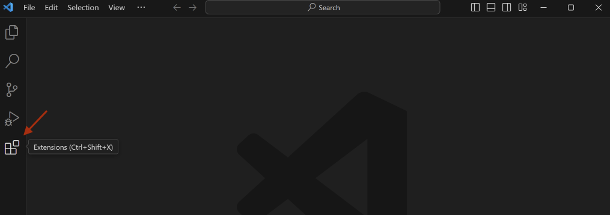
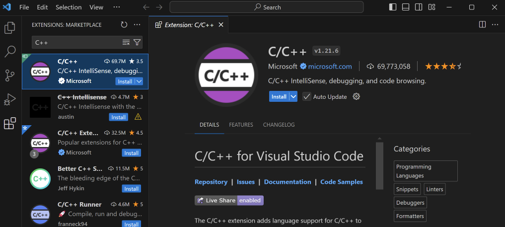
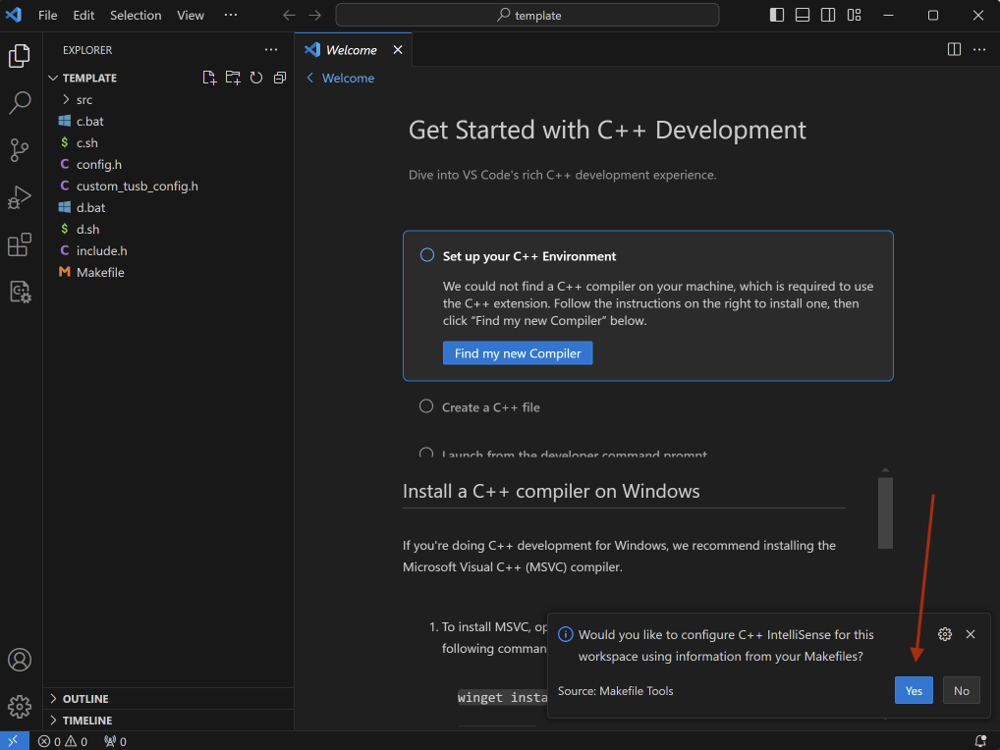
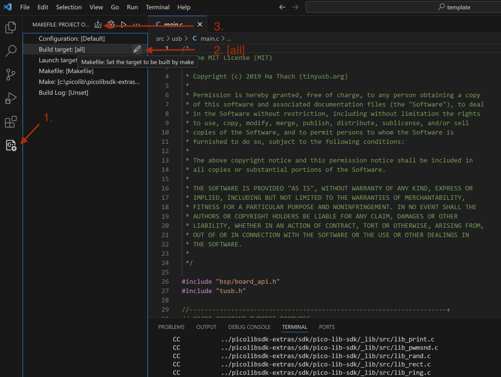

Tento repozitář obsahuje knihovny pro PicoLibSDK, které nejsou součástí samotného SDK, především knihovny pro práci
s WiFi, Bluetooth a USB. Build aplikací probíhá pomocí GNU Make. Oproti původnímu buildu v PicoLibSDK je možné mít
aplikace mimo adresář samotného SDK.

Aktuální verze je kompatibilní s těmito verzemi:

* PicoLibSDK – 2.01
* Pico SDK – 2.0.0
* Raspberry Pi Pico RP2040 / RP2350

Knihovny:

* Cyw43 - CYW43xx WiFi/BT SoC driver
* BTStack - Dual-mode Bluetooth stack, with small memory footprint.
* LWIP - A Lightweight TCP/IP stack
* TinyUSB - An open source cross-platform USB stack for embedded system

## Naklonování repozitáře a prvotní nastavení

Na svém počítači budete potřebovat:

* Git
* Visual Studio Code

Vše další si pak dotáhne a nastaví setup skript.

```bash
mkdir picopad
cd picopad
git clone --recurse-submodules https://github.com/tvecera/picolibsdk-extras.git
cd picolibsdk-extras
```

Naklonuje repozitář včetně submodulů Pico SDK a PicoLibSDK. Jedná se o rozsáhlé projekty a samotné naklonování může
zabrat i několik minut.

V případě, že pracujete na Linuxu nebo macOS, po naklonování repozitáře je ještě potřeba spustit příkaz:

macOS, Linux:

```bash
find . -type f -name *.sh -exec chmod +x {} \;

chmod +x build/_tools/[macos|linux]/elf2uf2
chmod +x build/_tools/[macos|linux]/LoaderCrc
chmod +x build/_tools/[macos|linux]/make
```

## Setup script (volitelné)

Jedná se o jednoduchý skript, jehož úkolem je:

* stažení ARM toolchainu, jeho rozbalení do adresáře picolibsdk-extras/build/arm-none-eabi
* uložení cesty k toolchainu do PATH
* uložení cesty k nástrojům pro build v adresáři picolibsdk-extras/build/_tools/[PLATFORM]/, jako je GNU Make,
  LoaderCrc, elf2uf2

V případě, že máte již toolchain a GNU Make nainstalované a v PATH, můžete spuštění setup scriptu přeskočit.

Skript spusťte z adrsáře picolibsdk-extras:

Windows:

```bash
setup.bat
```

macOS, Linux:

```bash
source ./setup.sh
```

## Test buildu aplikace

Překopírujte jeden z ukázkových programů do adresáře picopad:

Windows:

```bash
xcopy /E /I /Y "examples/template" "../template"
```

macOS, Linux:

```bash
cp -r examples/template ../
```

```bash
cd ../template
```

Spuštění kompilace: ```c.bat nebo ./c.sh nebo make all```

## Vývoj aplikací pro Picopad ve Visual Studio Code

Do Visual Studio Code si naistalujte tyto pluginy

* Microsoft C/C++ extension - https://marketplace.visualstudio.com/items?itemName=ms-vscode.cpptools
* Makefile Tools - https://marketplace.visualstudio.com/items?itemName=ms-vscode.makefile-tools
* C/C++ Extension Pack -  https://marketplace.visualstudio.com/items?itemName=ms-vscode.cpptools-extension-pack





Ve VS Code otevřete adresář s ukázkovým projektem:



Build projektu:



## Makefile

```makefile
# Adresar s nasim programem, povinny radek
APP_PATH = $(CURDIR)
# Adresar s picolibsdk-extras, povinny radek
PICO_LIB_SDK_EXTRAS_PATH = ../picolibsdk-extras
# Volitelne muzete zkonfigurovat adresar s PicoLibSDK
#PICO_LIB_SDK_PATH = ${PICO_LIB_SDK_EXTRAS_PATH}/sdk/pico-lib-sdk
# Volitelne muzete zkonfigurovat adresar s PicoSDK
#PICO_SDK_PATH = ${PICO_LIB_SDK_EXTRAS_PATH}/sdk/pico-sdk

# Nazev aplikace, vysledny soubor pro picopad bude mit tento nazev
TARGET=TEMPLATE
DEVICE=picopad10
DEVCLASS=picopad

# Prepinac pro ignorovani pico/cyw43 ve vasem projektu  
#USE_WIFI = 0
# Prepinac pro ignorovani pico/lwip do vaseho projektu
#USE_LWIP = 0
# Prepinac pro ignorovani podpory pro IPv6 v pico/lwip
#USE_IPV6 = 0
# Prepinac ignorovani pico/btstack ve vasem projektu
#USE_BTSTACK = 0
# Prepinac pro pouziti BT_CLASSIC v pico/btstack
#USE_CLASSIC = 1
# Prepinac pro pouziti BT_BLE v pico/btstack
# !!!! Portace neni jeste dokoncena
#USE_BLE = 1
# Prepinac pro pouziti BT SBC decoder / encoder v pico/btstack
#USE_SBC = 1
# Prepinac ignorovani pico/tinyusb ve vasem projektu
#USE_TINYUSB = 0
# Prepinac pridani KeyboardBT do vaseho projektu
#USE_KEYBOARD_BT = 1
# Prepinac zapnuti DEBUG u CYW43 a BTSTACK
#USE_DEBUG = 1

# ASM source files
ASRC +=

# C source files
CSRC +=

# C++ source files
SRC += src/main.cpp

# Makefile includes
include ${PICO_LIB_SDK_EXTRAS_PATH}/build/_makefile.inc
include ${PICO_LIB_SDK_EXTRAS_PATH}/build/Makefile.inc
```
