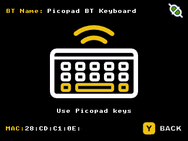

# KeyboardBT stack example

Příklad použití BTStacku a KeyboardBT z PicoSDK v PicoLibSDK.

KeyboardBT je naportovaná knihovna z arduino-pico a umožňuje vytvořit z vašeho Picopadu jednoduchou BT klávesnici.

