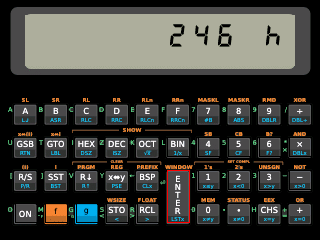
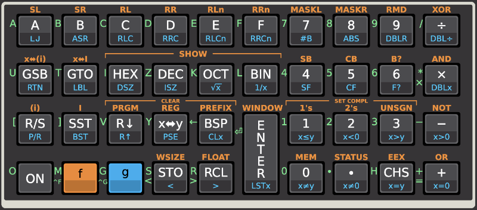

# HP16C Emulator for Picopad

The emulation is based on the Nonpareil project - a microcode-level simulation of HP calculators, ported for use on
Picopad, Pico with an ST7789 display.



There are three versions included:

- A version for Picopad and Picopad Pro
- A version for RP2040
- A desktop version built using SFML

## Picopad, Picopad Pro

The default version allows control using an attached keyboard or a virtual keyboard displayed on the screen.

### Build

```bash
./c.sh
```

### Key Map

_The keyboard layout and the image of the virtual keyboard were taken from the JRPN emulator – Jovial Reverse Polish
Notation Calculators - https://jrpn.jovial.com/_



## RP2040

**Implementation is not yet complete**

This version allows control via an attached keyboard or a connected matrix keyboard.

The key map is the same as for the Picopad version.

### Build

```bash
./c.pico.sh
```

## Desktop Version

This version can be run on a desktop and simulates the behavior and display of the Picopad version.

### Build

Before building, modify `Makefile.sfml` and adjust the paths to SFML:

**Makefile.sfml:**

```makefile
# SFML includes and libraries (adjust these paths to your environment)
SFML_LIB_DIR = /usr/local/Cellar/sfml/2.6.1/lib
SFML_INCLUDE_DIR = /usr/local/Cellar/sfml/2.6.1/include/SFML
```

```bash
# Build
./c.sfml.sh

# Run the emulator
./build/hp16c
```