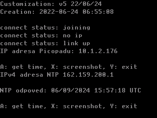

# CYW43 LWIP stack example

Příklad použití LWIP stacku z PicoSDK v PicoLibSDK.

Aplikace se po stisknutí tlačítka A pokusí stáhnout aktuální UTC čas z NTP serveru.

Před použitím a kompilací je nutné upravit SSID a heslo k wifi síti v main.cpp:

```c++
#define WIFI_SSID     "WIFI_SSID"
#define WIFI_PASSWORD "WIFI_PASSWORD"
```

