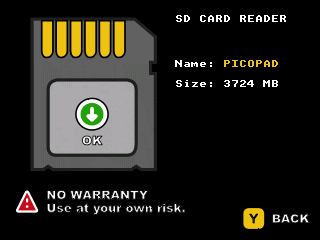

# TinyUSB example

## Picopad jako čtečka SD karet

Program vytvoří z Picopadu jednoduchou čtečku SD karet.

Jedná se o demonstraci použití TinyUSB v PicoLibSDK. Pozor, čtení a zápis na kartu je velmi pomalý a nepoužívejte ji na
čtení, zápis dat o které nechcete přijít.

Přes grafické UI systému je to prakticky nepoužitelné, nicméně v command line jsem si celkem úspěšně stahoval vytvořené
screenshoty z SD karty.

**⚠️ WARNING ⚠️**

**Disclaimer:**

This is an ALPHA VERSION, and it's still in the testing phase. Therefore, all operations should be performed at your own
risk. The author is not responsible for any damages, data loss, or other issues that may arise from improper use,
technical error, or other circumstances.